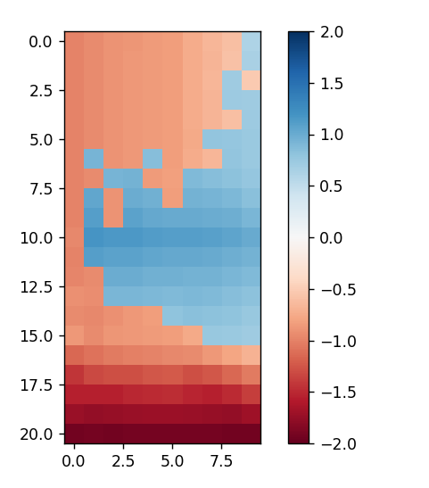
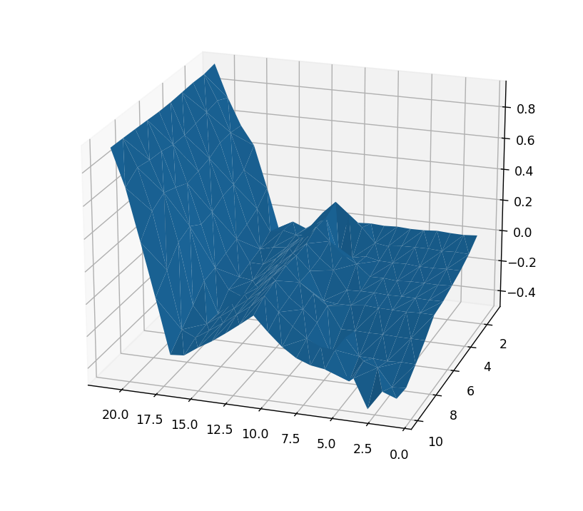

# Easy21

Game from David Silver's RL course. https://www.davidsilver.uk/wp-content/uploads/2020/03/Easy21-Johannes.pdf

Easy21 is a modifed version of blackjack played with the following rules:

*  The game is played with an infinite deck of cards (i.e. cards are sampled
with replacement)
*  Each draw from the deck results in a value between 1 and 10 (uniformly
distributed) with a colour of red (probability 1/5) or black (probability
2/3).
*  There are no aces or picture (face) cards in this game
*  At the start of the game both the player and the dealer draw one black
card (fully observed)
*  Each turn the player may either stick or hit
* If the player hits then she draws another card from the deck
*  If the player sticks she receives no further cards
*  The values of the player’s cards are added (black cards) or subtracted (red
cards)
*  If the player’s sum exceeds 21, or becomes less than 1, then she “goes
bust” and loses the game (reward -1)
*  If the player sticks then the dealer starts taking turns. The dealer always
sticks on any sum of 17 or greater, and hits otherwise. If the dealer goes
bust, then the player wins; otherwise, the outcome – win (reward +1),
lose (reward -1), or draw (reward 0) – is the player with the largest sum.

A model-free monte-carlo controlled reinforcement learning algorithm was trained on an environment following the rules of easy21. The model used a look up table to determine the best possible action at each of the 21 x 10 different states.

Tested on a small batch of 10^7 episodes, the optimal policy π was determined. The following graphs map each state s to a value between [-2, 2] where blue states (s < 0) favour hits and red states (s > 0) favour sticks. The greater the absolute value means the greater the expected reward yielded by picking that action. States close to zero are likely to be losing states regardless of the action chosen.

Plotting the v(s),

We are able to generate a stragetgy that is favoured to win in all scenarios except for incredibly unfavourable starting states. We see that we are recommended to stick with high numbers as further hits risks busting. We are also recommended to stick with low values as we risk busting in the reverse direction. We are only recommended to hit when we are drastically behind or if the opponennt has a good chance of terminating. Since they do not stop even after surprassing our stuck sum, they risk busting by going over 21, so sticking is generally a better strategy for most states.

